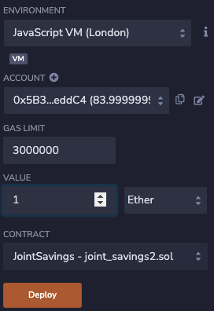
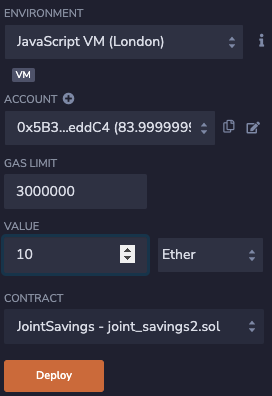
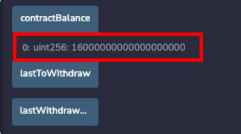
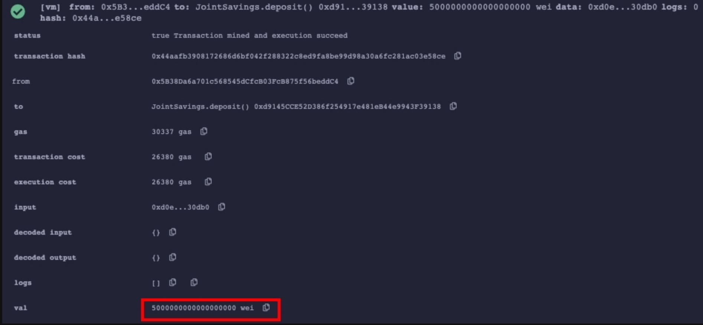
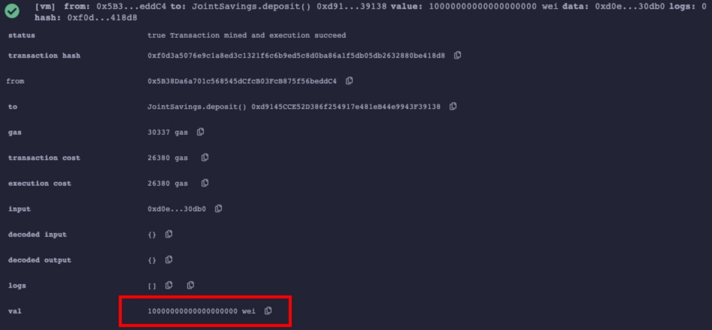
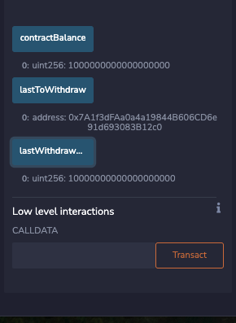

# Joint Savings Account on Ethereum Blockchain

In this project, a Solidity smart contract has been created to accept two parties, which will be able to control a joint savings account. This smart contract will use ether management functions. On this platform, users will be able to deposit and withdraw funds from the account.

---

## Technologies

This project leverages Solidity and remix.ethereum.org.

---

## Program Usage and Execution Results

Please go to remix.ethereum.orf and run the file with the code provided.

The following are used as the dummy addresses to send and transfer fund.

```Python
Dummy account1 address: 0x0c0669Cd5e60a6F4b8ce437E4a4A007093D368Cb
Dummy account2 address: 0x7A1f3dFAa0a4a19844B606CD6e91d693083B12c0
```

Next, the following 3 transactions are tested on the left side of the screen.

- Transaction 1: Send 1 ether as wei.


- Transaction 2: Send 10 ether as wei.


- Transaction 3: Send 5 ether as wei.


The balance is updated as follows


- Transaction 4: Withdrawing 5 ether into accountOne


- Transaction 5: Withdrawing 10 ether into accountTwo


The balance is updated as follows




  

---

## Contributors

Initial code is provided by: UC Berkeley Fintech Bootcamp

Code is modified by: Kevin BaRoss [[LinkedIn](https://www.linkedin.com/in/kevin-baross/)]


---
